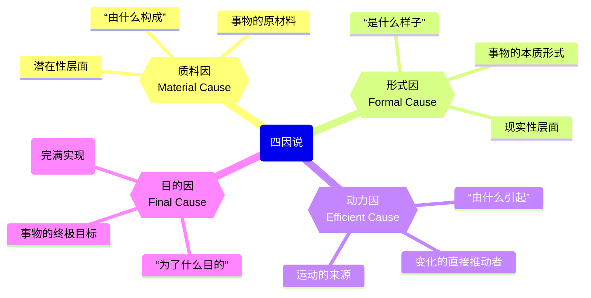
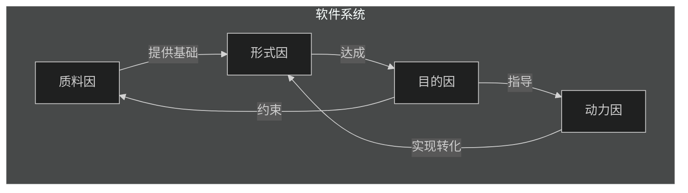

> 四因说由古希腊哲学家亚里士多德提出，将世界上事物的变化与运动的背后原因（古希腊语：αἴτιον）归纳为四大类。
>
>四因包括：
>- **质料**因：即构成事物的材料、元素或基质，例如砖瓦就是房子的质料因；
>- **形式**因：即决定事物“是什么”的本质属性，或者说决定一物“是如此”的样式，例如建筑师心中的房子式样，就是房子的形式因；
>- **动力**因：即事物的构成动力，例如，建筑师就是建成房子的动力因；
>- **目的**因：即事物所追求的目的，例如“为了安置人和财产”就是房子的目的因。

亚里士多德认为，凡感性实体，包括自然物和人造物，都具备这四种原因。

### 四因说与设计模式的映射本质

亚里士多德的 “四因说” 认为，任何事物的存在都离不开四个核心成因：

- 质料因：构成事物的 “材料”（对象的底层载体 / 依赖）；
- 形式因：事物的 “结构 / 本质”（对象的接口、抽象定义）；
- 动力因：推动事物生成 / 变化的 “动力”（对象的创建逻辑、行为触发机制）；
- 目的因：事物存在的 “目的”（对象的功能价值、协作目标）。

设计模式的核心作用，就是为软件对象的 “四因” 提供标准化解决方案 
—— 避免对象的 “成因缺失”（如无明确形式因导致接口混乱）或 “成因冲突”（如动力因与目的因不符导致行为低效）。

**协同关系**：

- 质料因与形式因构成**静态维度**：软件是什么
- 动力因与目的因构成**动态维度**：软件如何变化与为何存在
- 目的因对其他三因具有**统摄性**：亚里士多德认为"最终因是一切原因的原因"

## 实践应用：四因设计审查框架

在软件架构评审中，可以构建四因审查框架：

| 审查维度       | 关键问题                                              | 优秀实践标志                                             |
| -------------- | ----------------------------------------------------- | -------------------------------------------------------- |
| **质料因审查** | 系统资源是否高效利用？ 数据结构是否适合问题域？       | 享元模式减少内存占用 对象池优化资源使用                  |
| **形式因审查** | 架构是否清晰表达业务概念？ 模块边界是否符合康威定律？ | 领域驱动设计(DDD)的界限上下文 清晰的接口与实现分离       |
| **动力因审查** | 系统如何响应变化？ 构建与部署流程是否顺畅？           | CI/CD流水线自动化 可插拔架构支持功能扩展                 |
| **目的因审查** | 系统核心价值是否清晰？ 设计决策是否服务终极目标？     | 用户旅程映射与关键路径优化 架构决策记录(ADR)明确目的导向 |

**软件设计的三阶段**：

1. **现成状态**(Vorhandenheit)：形式与质料分离，设计文档与代码割裂
2. **过渡状态**：通过重构，使形式与质料逐渐**统一**
3. **上手状态**：设计内化于代码，架构"透明"地支持开发

## 四因在软件设计中的映射

### 1. 质料因：软件的物质基础

*关注"软件由什么构成"*

**哲学内涵**：在亚里士多德看来，质料是潜能的载体，尚未实现其形式。在软件中，代码、数据和资源构成了系统的质料基础。

**对应设计模式**：

- **享元模式**(Flyweight) - 体现"**共享**内在状态"的质料优化
- **原型模式**(Prototype) - 通过克隆而非**重复**创建来高效使用质料
- **建造者模式**(Builder) - **分离**复杂对象的构建过程与其组成部分

**本质思考**：

> "软件的质料不仅是二进制代码，更是信息的载体。"

### 2. 形式因：软件的本质结构

*关注"软件是什么样子"*

**哲学内涵**：形式是事物的本质，使其成为其所是的东西。在软件中，架构、接口和设计模式定义了系统的本质结构。

**对应设计模式**：

- **适配器模式**(Adapter) - 形式转换，使不**兼容**接口能和谐共存
- **桥接模式**(Bridge) - **分离**抽象与实现，使形式与内容**独立**演化
- **组合模式**(Composite) - 以统一形式表达部分-整体关系
- **装饰器模式**(Decorator) - 通过**组合**而非继承扩展形式
- **外观模式**(Facade) - 提供简化的**统一**形式
- **代理模式**(Proxy) - **控制**对真实形式的访问

**本质思考**：

> "软件的形式不是UI界面，而是其内在逻辑结构。好的软件设计应先确定架构再填充代码。"

### 3. 动力因：软件的构建动力

*关注"软件如何被创建和变化"*

**哲学内涵**：动力因是**变化**的直接原因，使潜能转化为现实的推动力。在软件开发中，这是构建过程、团队协作和演化机制。

**对应设计模式**：

- **单例模式**(Singleton) - 控制实例创建的动力
- **工厂方法**(Factory Method) - 将对象创建的责任委托给子类
- **抽象工厂**(Abstract Factory) - 提供创建对象族的统一动力
- **命令模式**(Command) - 将请求封装为对象，分离调用者与执行者
- **状态模式**(State) - 允许对象在其内部状态改变时改变其行为

**本质思考**：

> "软件的动力因不仅是编译器和IDE，更是开发者的意图与创造力。"

### 4. 目的因：软件的终极目标

*关注"软件为了什么而存在"*

**哲学内涵**：目的因(telos)是事物的终极目标，是亚里士多德体系中最关键的原因。在软件中，是业务价值、用户体验和系统使命。

**对应设计模式**：

- **责任链模式**(Chain of Responsibility) - 使多个对象有机会处理请求，提高系统灵活性
- **解释器模式**(Interpreter) - 为特定语言提供执行引擎
- **迭代器模式**(Iterator) - 提供访问集合元素的统一方式
- **中介者模式**(Mediator) - 简化对象间通信，降低耦合
- **备忘录模式**(Memento) - 在不破坏封装的前提下保存对象状态
- **观察者模式**(Observer) - 建立对象间的依赖关系，实现状态同步
- **策略模式**(Strategy) - 定义可互换的算法族
- **模板方法**(Template Method) - 定义算法骨架，延迟特定步骤到子类
- **访问者模式**(Visitor) - 将操作与对象结构分离

**本质思考**：

> "软件的最高目的不是运行，而是服务。"

掌握设计模式，不仅是掌握23种工具，更是培养一种**哲学式的设计思维**：

在面对软件系统的混沌时，能本能地识别出当前困境所属的**根本**范畴（是存在论问题、结构论问题还是目的论问题），从而选择最契合那一范畴思维方式的模式来构建清晰、健壮而富有弹性的解决方案。