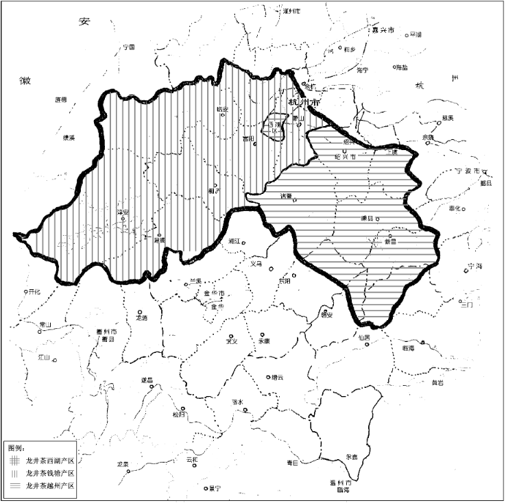

# GB/T 18650-2008 地理标志产品 龙井茶

- **ICS 分类**：67.140.10
- **中国标准分类**：X55
- **发布部门**：中华人民共和国国家质量监督检验检疫总局、中国国家标准化管理委员会
- **发布日期**：2008-07-15
- **实施日期**：2008-10-01
- **替代标准**：GB 18650-2002

## 前言

1. 本标准根据国家质量监督检验检疫总局颁布的 2005 第 78 号令《地理标志产品保护规定》及 GB/T 17924《地理标志产品标准通用要求》制定。
2. 本标准代替 GB 18650-2002《原产地域产品 龙井茶》，与 GB 18650-2002 相比主要变化如下：
   - 标准属性由强制性国家标准改为推荐性国家标准；
   - 根据《地理标志产品保护规定》，将标准名称改为《地理标志产品 龙井茶》；
   - 质量安全指标采用 GB 2762《食品中污染物限量》、GB 2763《食品中农药最大残留限量》的相关规定；
   - 加工技术中增加 “机械加工应符合龙井茶加工工艺要求”；
   - 删除了 “注：碎末茶为推荐指标” 内容。
3. 本标准的附录 A 为规范性附录。
4. 本标准由全国原产地域产品标准化工作组提出并归口。
5. 本标准起草单位：浙江省农业厅经济作物管理局、农业部茶叶质量监督检验测试中心、浙江省供销合作总社、浙江大学、杭州西湖龙井茶商会、新昌县名茶协会。
6. 本标准主要起草人：毛祖法、陆德彪、刘新、王金贤、龚淑英、戚国伟、赵玉汀、王春霞。
7. 本标准所代替标准的历次版本发布情况为：GB 18650-2002。

## 1 范围

本标准规定了龙井茶的地理标志产品保护范围、术语和定义、自然环境和生产、要求、试验方法、检验规则及标志、标签、包装、运输、贮存。本标准适用于国家质量监督检验检疫行政主管部门根据《地理标志产品保护规定》批准保护的龙井茶。

## 2 规范性引用文件

下列文件中的条款通过本标准的引用而成为本标准的条款。凡是注日期的引用文件，其随后所有的修改单（不包括勘误的内容）或修订版均不适用于本标准，然而，鼓励根据本标准达成协议的各方研究是否可使用这些文件的最新版本。凡是不注日期的引用文件，其最新版本适用于本标准。

- GB/T 191 包装储运图示标志（GB/T 191-2008，ISO 780:1997，MOD）
- GB 2762 食品中污染物限量
- GB 2763 食品中农药最大残留限量
- GB 4285 农药安全使用标准
- GB 7718 预包装食品标签通则
- GB/T 8302 茶 取样
- GB/T 8304 茶 水分测定（GB/T 8304-2002，eqv ISO 1573:1980）
- GB/T 8305 茶 水浸出物测定（GB/T 8305-2002，eqv ISO 9768:1994）
- GB/T 8306 茶 总灰分测定（GB/T 8306-2002，eqv ISO 1575:1987）
- GB/T 8311 茶 粉末和碎茶含量测定
- GB/T 8321（所有部分） 农药合理使用准则
- NY/T 787 茶叶感官评审通用方法
- SB/T 10035 茶叶销售包装通用技术条件
- 国家质量监督检验检疫总局令 [2005] 第 75 号 《定量包装商品计量监督管理办法》
- 国家质量监督检验检疫总局公告 [2005] 第 151 号 《中华人民共和国地理标志保护产品专用标志》

## 3 术语和定义

下列术语和定义适用于本标准。

### 3.1 龙井茶（Longjing tea）

在本标准第 4 章范围内采摘的符合 5.2.1 茶树品种要求的茶树鲜叶，按照传统工艺在地理标志产品保护范围内加工而成，具有 “色绿、香郁、味醇、形美” 的扁形绿茶。

## 4 地理标志产品保护范围

龙井茶地理标志产品保护范围限于国家质量监督检验检疫行政主管部门根据《地理标志产品保护规定》批准的范围，具体划分如下：

- **西湖产区**：杭州市西湖区（西湖风景名胜区）现辖行政区域；
- **钱塘产区**：杭州市萧山、滨江、余杭、富阳、临安、桐庐、建德、淳安等县（市、区）现辖行政区域；
- **越州产区**：绍兴市绍兴、越城、新昌、嵊州、诸暨等县（市、区）现辖行政区域，以及上虞、磐安、东阳、天台等县（市）现辖部分乡镇区域。

龙井茶地理标志产品保护范围见附录 A（规范性附录）。

## 5 自然环境与生产

### 5.1 自然环境

1. 龙井茶产区地处钱塘江、曹娥江流域的山地、丘陵间，温暖多雨，空气湿润；
2. 茶园土壤多为红黄壤及其变种，pH 值 4.3~6.5；
3. 茶园环境符合国家环境保护的有关规定。

### 5.2 栽培技术

#### 5.2.1 茶树品种

应选用龙井群体、龙井 43、龙井长叶、迎霜、鸠坑种等经审（认）定的适宜加工龙井茶的茶树良种。

#### 5.2.2 茶园耕作

- **浅耕**：在茶树生长季节进行，深度 10cm~15cm；
- **深耕**：在秋季茶园停止采摘后进行，深度 20cm~30cm。

#### 5.2.3 茶园施肥

1. **施肥时期**：
   - 春茶前施催芽肥，一般在 2 月中下旬进行；
   - 夏茶前追肥，一般在春茶结束后的 4 月下旬至 5 月中旬进行；
   - 秋茶前追肥，一般在 6 月下旬至 9 月中旬分期进行；
   - 秋冬季施基肥，一般在 10 月至 11 月上旬结合深耕进行。
2. **肥料种类**：基肥以有机肥与磷、钾肥为主，追肥以无机氮肥为主；
3. **施肥配比**：一般按氮∶磷∶钾为 3∶1∶1 比例配施。

#### 5.2.4 农药的使用

使用农药应严格遵循 GB 4285、GB/T 8321（所有部分）的规定。

### 5.3 鲜叶

#### 5.3.1 鲜叶采摘

1. **开采要求**：当茶树蓬面每平方米有 10 个～15 个茶芽符合鲜叶质量要求时即可开采；
2. **间隔时间**：春茶每日或隔日采，夏茶和秋茶间隔期可适当延长；
3. **采摘方法**：分批分次，提手采摘，不得掐采、捋采、抓采和带老叶杂物采摘。

#### 5.3.2 鲜叶质量

芽叶完整，色泽鲜绿，匀净。用于同批次加工的鲜叶，其嫩度、匀度、净度、新鲜度应基本一致。鲜叶质量分为特级、一级、二级、三级、四级，具体要求如下表，低于四级的以及劣变鲜叶不得用于加工龙井茶。

| 等级 | 要求                                                         |
| ---- | ------------------------------------------------------------ |
| 特级 | 一芽一叶初展，芽叶夹角度小，芽长于叶，芽叶匀齐肥壮，芽叶长度不超过 2.5cm |
| 一级 | 一芽一叶至一芽二叶初展，以一芽一叶为主，一芽二叶初展在 10% 以下，芽稍长于叶，芽叶完整、匀净，芽叶长度不超过 3cm |
| 二级 | 一芽一叶至一芽二叶，一芽二叶在 30% 以下，芽与叶长度基本相等，芽叶完整，芽叶长度不超过 3.5cm |
| 三级 | 一芽二叶至一芽三叶初展，以一芽二叶为主，一芽三叶不超过 30%，叶长于芽，芽叶完整，芽叶长度不超过 4cm |
| 四级 | 一芽二叶至一芽三叶，一芽三叶不超过 50%，叶长于芽，有部分嫩的对夹叶，长度不超过 4.5cm |

#### 5.3.3 鲜叶运输、贮存

1. 应使用透气良好的篮篓盛装鲜叶，运输工具应清洁卫生，运输时不得日晒雨淋，不得与有异味、有毒物品混运；
2. 鲜叶采摘后应及时运到加工场所；
3. 盛装、运输、贮存鲜叶，应轻放、轻翻，不得加压。

### 5.4 加工

1. **加工器具**：可选用传统炒茶灶、电热炒茶锅和其他加工机械；
2. **加工工艺**：鲜叶摊放、青锅、摊凉回潮、辉锅；
3. **加工技术**：手工加工采用 “抓、抖、搭、榻、捺、推、扣、甩、磨、压” 等传统手法，机械加工应符合龙井茶加工工艺要求。

## 6 要求

### 6.1 分级

按感官品质分为：特级、一级、二级、三级、四级、五级。

### 6.2 感官品质

各级龙井茶感官品质应符合下表要求：

| 项目     | 特级                                                         | 一级                                           | 二级                                 | 三级                                         | 四级                                       | 五级                                         |
| -------- | ------------------------------------------------------------ | ---------------------------------------------- | ------------------------------------ | -------------------------------------------- | ------------------------------------------ | -------------------------------------------- |
| 外形     | 扁平光润、挺直尖削；嫩绿鲜润；匀整重实；匀净                 | 扁平光滑尚润、挺直；嫩绿尚鲜润；匀整有锋；洁净 | 扁平挺直、尚光滑；绿润；匀整；尚洁净 | 扁平、尚光滑、尚挺直；尚绿润；尚匀整；尚洁净 | 扁平、稍有宽扁条；绿稍深；尚匀；稍有青黄片 | 尚扁平、有宽扁条；深绿较暗；尚整；有青壳碎片 |
| 香气     | 清香持久                                                     | 清香尚持久                                     | 清香                                 | 尚清香                                       | 纯正                                       | 平和                                         |
| 滋味     | 鲜醇甘爽                                                     | 鲜醇爽口                                       | 尚鲜                                 | 尚醇                                         | 尚醇                                       | 尚纯正                                       |
| 汤色     | 嫩绿明亮、清澈                                               | 嫩绿明亮                                       | 绿明亮                               | 尚绿明亮                                     | 黄绿明亮                                   | 黄绿                                         |
| 叶底     | 芽叶细嫩成朵、匀齐、嫩绿明亮                                 | 细嫩成朵、嫩绿明亮                             | 尚细嫩成朵、绿明亮                   | 尚成朵、有嫩单片、浅绿尚明亮                 | 尚嫩匀稍有青张、尚绿明                     | 尚嫩欠匀、稍有青张、绿稍深                   |
| 其他要求 | 无霉变，无劣变，无污染，无异味；产品洁净，不得着色，不得夹杂非茶类物质，不含任何添加剂 | 同特级其他要求                                 | 同特级其他要求                       | 同特级其他要求                               | 同特级其他要求                             | 同特级其他要求                               |

### 6.3 理化指标

理化指标应符合下表规定：

| 项目           | 特级、一级、二级 | 三级、四级、五级 |
| -------------- | ---------------- | ---------------- |
| 水分 / %       | ≤6.5             | ≤7.0             |
| 总灰分 / %     | ≤6.5             | ≤7.0             |
| 水浸出物 / %   | ≥36.0            | ≥36.0            |
| 粉末和碎茶 / % | ≤1.0             | ≤1.0             |

### 6.4 质量安全指标

1. 污染物限量指标应符合 GB 2762 的规定；
2. 农药残留限量指标应符合 GB 2763 的规定。

### 6.5 净含量

定量包装规格由企业自定，净含量负偏差应符合《定量包装商品计量监督管理办法》（国家质量监督检验检疫总局令 [2005] 第 75 号）的规定。

## 7 试验方法

### 7.1 感官品质

按 NY/T 787 的规定执行。

### 7.2 理化指标

1. **水分**：按 GB/T 8304 的规定执行；
2. **粉末和碎茶**：按 GB/T 8311 的规定执行；
3. **总灰分**：按 GB/T 8306 的规定执行；
4. **水浸出物**：按 GB/T 8305 的规定执行。

### 7.3 质量安全指标

按 GB 2762 和 GB 2763 的规定执行。

### 7.4 净含量

按《定量包装商品计量监督管理办法》（国家质量监督检验检疫总局令 [2005] 第 75 号）的规定执行。

## 8 检验规则

### 8.1 组批

在生产加工过程中形成的独立数量的产品为一批（唛），同批（唛）产品的品质规格和包装应一致。

### 8.2 抽样

按 GB/T 8302 的规定执行。

### 8.3 交收（出厂）检验

1. 每批产品交收（出厂）前，生产单位应进行检验，检验合格并附有合格证的产品方可交收（出厂）；
2. 交收（出厂）检验内容为感官品质、水分、净含量、粉末和碎茶及包装标签。

### 8.4 型式检验

#### 8.4.1 型式检验触发条件

有下列情形之一者应进行型式检验：

- a) 正常生产情况下每年进行一次；
- b) 因人为或自然因素使原材料或生产环境发生较大变化时；
- c) 质量监督机构或主管部门提出型式检验要求时。

#### 8.4.2 型式检验项目

型式检验项目为本标准第 6 章规定的全部项目。

### 8.5 判定规则

1. 检验结果全部符合本标准规定技术要求的产品，则判该批产品为合格；
2. 凡劣变、有污染、霉变、有添加剂或质量安全指标中有一项不符合本标准要求，则判定该批产品不合格；
3. 感官指标其他项目、理化指标和净含量任一项目不符合本标准要求时，可用留存样对不符合的项目进行复检。若留存样检验结果符合本标准要求，则判定该批产品合格；若留存样检验结果有任何一个项目不符合本标准要求，则判定该批产品不合格。

## 9 标志、标签、包装、运输、贮存

### 9.1 标志

1. 获得批准的企业，可在其产品包装上使用龙井茶地理标志产品专用标志，并标示龙井茶产区名称，标志应符合国家质量监督检验检疫总局公告 2005 年第 151 号的要求；
2. 产品的包装储运图示标志应符合 GB/T 191 的规定。

### 9.2 标签

龙井茶销售的包装标签应符合 GB 7718 的规定。

### 9.3 包装

容器和材料应符合 SB/T 10035 的规定。

### 9.4 运输

运输工具应清洁、干燥、无异味、无污染；运输时应防潮、防雨、防曝晒；装卸时应轻放轻卸，严禁与有毒、有异气味、易污染的物品混装、混运。

### 9.5 贮存

成品应贮存在清洁、干燥、阴凉、无异味的专用仓库内（用生石灰收灰或冷藏），库房温度以 5℃左右为宜，避免阳光直射与高温潮湿存放。

## 附录 A（规范性附录）龙井茶地理标志产品保护范围图

龙井茶地理标志产品保护范围见图 A.1（注：原文含地图图示，标注 “龙井茶西湖产区”“龙井茶钱塘产区”“龙井茶越州产区”，涉及区域包括杭州市、绍兴市及周边部分县市）。

## 参考

- [标准号：GB/T 18650-2008 地理标志产品 龙井茶](https://openstd.samr.gov.cn/bzgk/gb/newGbInfo?hcno=96D0A5A54BBC305315CDCB3B1E0D90E6)