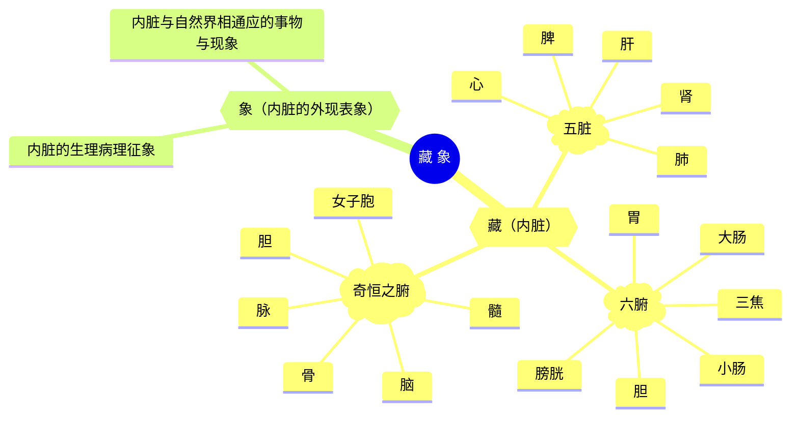

# 藏象学说

"藏象"一词，首先见于《黄帝内经》。藏，通"脏"，是指隐藏于体内的内脏；象，是指形象或现象。藏象，即指藏于体内的内脏及其表现于外的生理、病理现象。可见，**"藏"是"象"的内在根据**，**"象";是"藏"的外在反映**。

藏象学说的内容主要有三个部分：一是**内脏的生理功能和病理变化**，其中重点阐述五脏的生理功能；二是**五脏与形体官窍之间的关系**，包括五脏与五体（脉、筋、 肉、皮、骨）及五官九窍（舌、目、口、鼻、耳、二阴）之间的联系等；三是**脏腑之间的关系**，包括五脏之间、六腑之间以及五脏与六腑之间的多种联系。

藏象学说，主要**以脏腑为基础**，所以有时也称其为"脏腑学说"。脏腑是内脏的总称，主要有五脏与六腑两类。五脏，即**心、肝、脾、肺、肾**；六腑，即**胆、胃、小 肠、大肠、膀胱、三焦。**此外，还有一类组织器官，由于其功能类似于脏，形态相似于腑，中医学把它们称为"奇恒之腑"。奇恒之腑包括**脑、髓、骨、脉、胆、女子胞**。

五脏与六腑虽同为内脏，但各自的功能特点是不同的。五脏共同的功能特点是"藏精气"，即贮藏人体维持生命活动所需要的精微物质；六腑共同的功能特点是"传化物"，即受纳、消化饮食物，并吸收其精微，排泄其糟粕。正因为这两者总的功能特点不一样，所以将它们划分为脏与腑两类。

## 五脏六腑的区别：

| 内容 | 脏腑名称                       | 属性   | 结构     | 生理           | 病理   | 治疗   |
| :--- | :----------------------------- | :----- | :------- | :------------- | :----- | :----- |
| 五脏 | 肝，心，脾，肺，肾             | 阴、里 | 多实质性 | 化生、贮藏精气 | 多虚证 | 多补法 |
| 六腑 | 胆、胃、大肠、小肠、膀胱、三焦 | 阳、表 | 多空腔性 | 受盛、传化水谷 | 多实证 | 多泻法 |

脏腑是人体生命活动的核心。维持五脏六腑生理功能的物质基础有两方面：

一是解剖**形态结构**。不同的形态结构与内脏的某些生理功能有着一定的联系，如心脏与脉管直接相连，故心有推动血液在脉管内循行的功能；胃与食道、小肠相通，故胃有受纳、腐熟饮食的作用。所以内脏的形态结构，是维持其生理功能的物质基础之一。中医学早在2000多年前就进行过人体解剖学的观察与研究，在《黄帝内经》、《难经》等古医籍中，有关于骨骼的长短，以及胃肠等脏器的大小、长短、容 量等均有详细记载。但是，由于中医学更强调人体整体功能的综合表现，更善于从外部现象推测生命的内在本质，并在不受解剖形态限制的前提下形成了关于人体生 理病理的庞大理论体系。

二是气、血、阴、阳等**精微物质**。藏象学说认为，构成脏腑并维持其生理功能的主要物质基础是气、血、阴、阳等精微物质，一切病埋变化 也都以这些精微物质的不足或紊乱为条件。从形质上讲，这些精微物质是极其精细而微小的，**不能用肉眼直接观察**，但可以从其生理功能及其病理变化方面来认识它们的本质并加以区分。一般来说，**气与阳**均具有温煦、推动和固摄作用，而气以推动、固摄作用为主，阳以温煦作用为主；**血与阴**均具有营养和滋润作用，而血以营养作用为主，阴以滋润作用为主。由于各脏腑器官气血阴阳的气化形式不同，因此不同的脏腑就具有各自不同的生理功能。

总之，中医藏象学说是研究脏腑和躯体组织器官的生理功能、病理变化及其相互关系的学说，是中医学理论体系的核心。**虽然其脏腑名称与现代医学某些器官的名称相同，但生理功能却不完全相同**。因为藏象学说的形成，主要是通过生活体验和临床实践，即对生理病理现象和治疗效应的观察等方面来认识内脏的，所以中医学脏腑的概念就大大超越了解剖形态的范畴。一般认为，中医学所述的脏腑功能范围较广，不仅包含着西医同一脏器的部分功能，而且还概括了其他相关器官的某些功能在内。因此，中医学的脏腑不单纯是解剖学的概念，更重要的是一些**综合性的功能单位**。