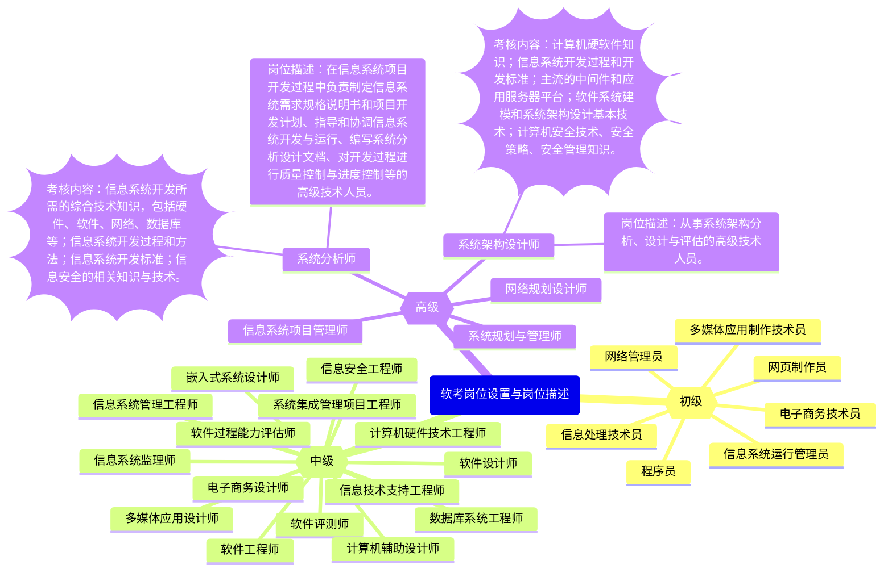

```mermaid
mindmap
(软考岗位设置与岗位描述)
  {{初级}}
    程序员
    网络管理员
    信息处理技术员
    信息系统运行管理员
    网页制作员
    电子商务技术员
    多媒体应用制作技术员
  {{中级}}
    软件评测师
    软件设计师
    软件工程师
    多媒体应用设计师
    嵌入式系统设计师
    电子商务设计师
    系统集成管理项目工程师
    信息系统监理师
    数据库系统工程师
    信息系统管理工程师
    信息安全工程师
    计算机辅助设计师
    信息技术支持工程师
    计算机硬件技术工程师
    软件过程能力评估师
  {{高级}}
    信息系统项目管理师
    系统分析师
      ))考核内容：信息系统开发所需的综合技术知识，包括硬件、软件、网络、数据库等；信息系统开发过程和方法；信息系统开发标准；信息安全的相关知识与技术。((
      岗位描述：在信息系统项目开发过程中负责制定信息系统需求规格说明书和项目开发计划、指导和协调信息系统开发与运行、编写系统分析设计文档、对开发过程进行质量控制与进度控制等的高级技术人员。
    系统架构设计师
      ))考核内容：计算机硬软件知识；信息系统开发过程和开发标准；主流的中间件和应用服务器平台；软件系统建模和系统架构设计基本技术；计算机安全技术、安全策略、安全管理知识。((
      岗位描述：从事系统架构分析、设计与评估的高级技术人员。
    网络规划设计师
    系统规划与管理师
    
```

