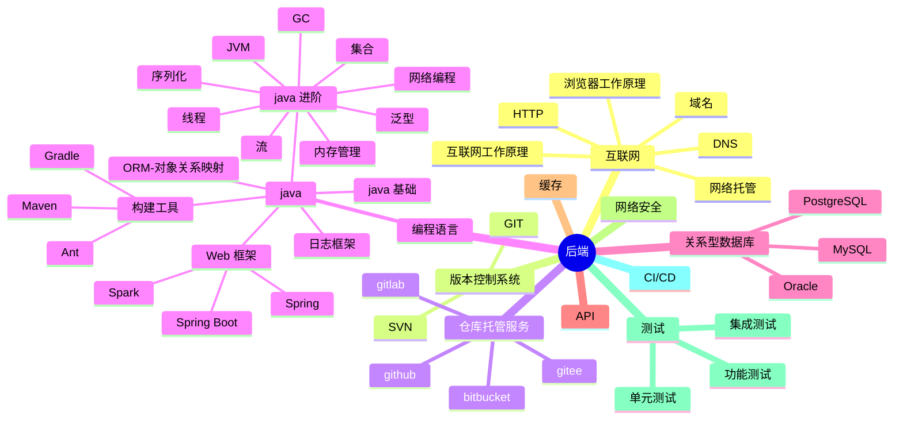

https://roadmap.sh/backend

```mermaid
mindmap
((后端))
  互联网
  	互联网工作原理
  	浏览器工作原理
  	HTTP
  	DNS
  	域名
  	网络托管
  版本控制系统
    GIT
    SVN
  仓库托管服务
    github
    gitlab
    gitee
    bitbucket
    
  编程语言
    java
      java 基础
      java 进阶
        内存管理
        集合
        序列化
        网络编程
        泛型
        流
        JVM
        GC
        线程
        
      构建工具
      	Gradle
      	Maven
      	Ant
      Web 框架
        Spring
        Spring Boot
        Spark
      日志框架
      ORM-对象关系映射
  
  关系型数据库
    MySQL
    PostgreSQL
    Oracle
    
 API
 
 缓存
 
 网络安全
 
 测试
   集成测试
   单元测试
   功能测试
   
 CI/CD
    
  
```

https://roadmap.sh/java